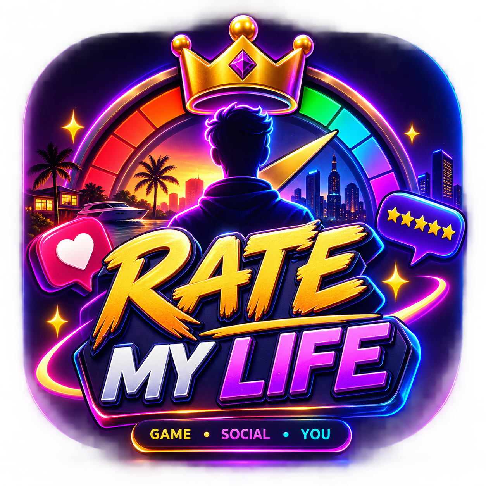
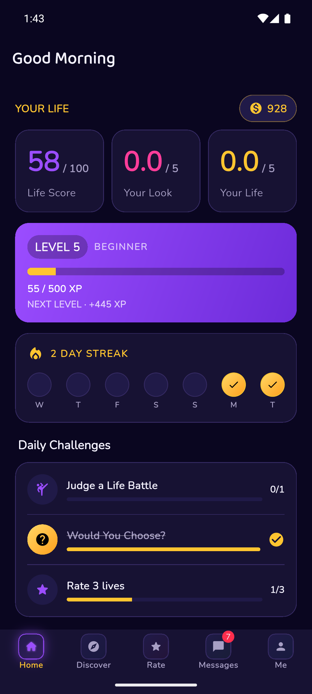
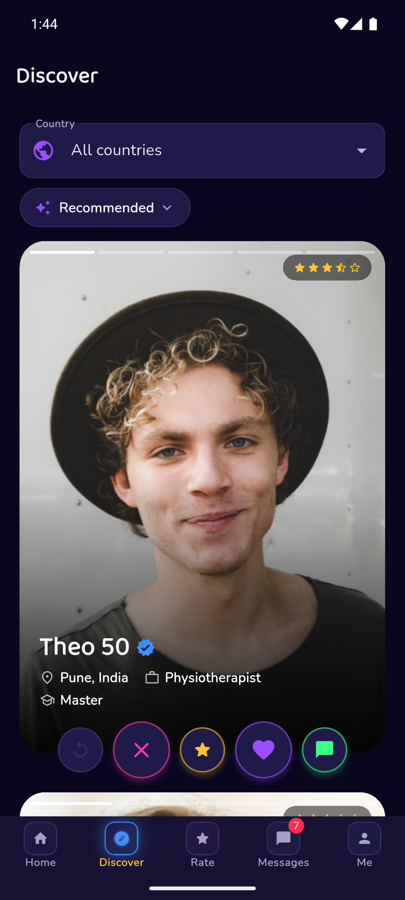
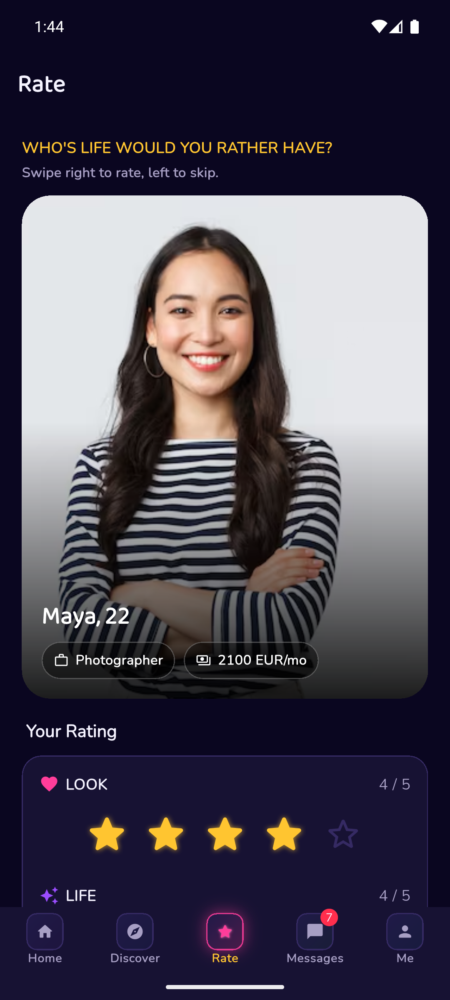
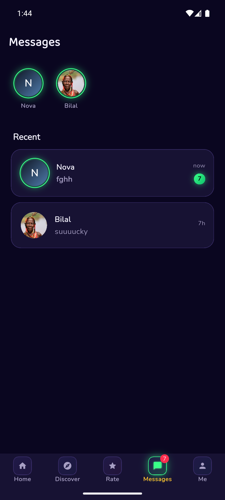

<div align="center">



# ✨ RATE MY LIFE ✨

### Game · Social · You

*Build an anonymous life. Get a score. Let the world rate it.*

[](https://flutter.dev)
[](https://dart.dev)
[](https://firebase.google.com)
[](#)
[](#-testing)
[](#-security)

</div>

<br/>

> ⚠️ **Important:** the Life Score is entertainment and social comparison — it is **never** presented as a measurement of anyone's human worth. That rule is non-negotiable in this codebase.

---

## 🕹️ What is this?

**Rate My Life** turns "how's your life going?" into a social game. Create an anonymous profile, tell it about your career, finances, lifestyle and habits, and a transparent algorithm turns that into a **Life Score**. Then the community rates you too — and the gap between the algorithm and what people actually think of you *is part of the game*.

The core loop:

```
Create Life → Get Score → Publish → People Discover → People Rate
      ↑                                                      │
      └──────────── Share ← Compare ← Receive Rating ────────┘
```

...and around that loop, a whole arcade of ways to **play**, **earn**, and **come back tomorrow**.

## 💜 Features

<table>
<tr>
<td width="50%" valign="top">

**🎯 Core Loop**
- Anonymous profile creation, no name/email ever collected
- Transparent, category-broken-down Life Score
- Tinder-style swipe rating (1–10, no self-rating)
- Real percentiles — age group, country, overall
- Discover, Leaderboard, "New & Rising", "Biggest Gaps"
- **✨ Get Life Advice** — a rule-based "life coach" sheet with a ~230-variant tip bank, personalized to your real background

**💬 Social**
- Direct messages & 1:1 audio calls (WebRTC)
- Comments, reactions, best-photo voting
- Block / report on everything, always
- **⚔️ Life Battles** — head-to-head profile duels with a full VS-intro → countdown → reveal arcade sequence
- **🤔 Would You Choose?** — daily would-you-rather with **real** community results

</td>
<td width="50%" valign="top">

**🏆 Progression**
- XP, levels, ranks, daily streaks
- Daily challenges, achievements, coins
- Cosmetic profile frames
- **🔮 What If? Simulator** — live-preview any life change against the real scoring engine, never saved
- **☢️ Nuke / Cure** — spend coins to dent a rival's score, or heal your own — pure chaos, zero worth-judgment

**💰 Monetization**
- Google AdMob — banner + rewarded video (300 free coins)
- Google Play Billing — 5 coin packages, real store pricing
- Every reward funnels through one auditable coin/XP ledger

**🔒 Privacy & security by design**
- Anonymous ratings — not even the profile owner can see who rated them
- Income/savings hidden by default, opt-in only
- Firestore rules **validate every reward amount and score bound**, not just "who's allowed to write" — see [🛡️ Security](#-security)

</td>
</tr>
</table>

## 📱 Screenshots

<table>
<tr>
<td align="center" width="25%"><br/><sub>Home</sub></td>
<td align="center" width="25%"><br/><sub>Discover</sub></td>
<td align="center" width="25%"><br/><sub>Rate</sub></td>
<td align="center" width="25%"><br/><sub>Messages</sub></td>
</tr>
</table>

## 🧬 Tech stack

| Layer | Tech |
|---|---|
| App | Flutter 3.47 / Dart 3.13, Material 3, Riverpod |
| Backend | Firebase — Auth (anonymous), Firestore, Storage, Cloud Functions |
| Ads / Payments | Google Mobile Ads SDK, Google Play Billing (`in_app_purchase`) |
| Fonts | Baloo 2 (display) + Nunito (body), via `google_fonts` |
| Calls | WebRTC (`flutter_webrtc`), STUN-only signaling over Firestore |

Architecture is a straightforward `presentation → domain → data` split — pure calculation/rules services, `Local*`/`Remote*` repository pairs behind one interface, and a single `AppController` (`ChangeNotifier`) as the app's source of truth. No backend framework, no microservices — this is an MVP, built to stay readable.

## 🚀 Getting started

```bash
flutter pub get
flutterfire configure   # generates the Firebase config this repo intentionally excludes
flutter run
```

`android/app/google-services.json` and `lib/firebase_options.dart` aren't committed — they identify a specific Firebase project, so regenerate them for your own via [`flutterfire configure`](https://firebase.google.com/docs/flutter/setup).

## 🧪 Testing

```bash
flutter test          # 417 tests — pure services, repositories, controller integrations, widgets
flutter analyze        # zero-issue baseline
```

Every `Remote*Repository` gets round-trip, no-duplicate-write, and cross-user-isolation coverage against `fake_cloud_firestore` — but the fake doesn't enforce security rules, so `firestore.rules` changes get a **separate**, real check (see below).

## 🛡️ Security

This app's coin/XP/score economy is a real, live-money-adjacent system — a rewarded ad grants coins, coins buy real Google Play products, and a compromised economy is a real problem, not just a bug. So `firestore.rules` doesn't just gate *who* can write; it validates *what* they're allowed to write:

- **Every reward transaction is amount-checked.** `xpTransactions`/`coinTransactions` — the ledger `Wallet`/`LevelInfo` are summed from — validate the `amount` against the real reward tables server-side, not just that you're writing to your own record. A forged `{amount: 999999999}` write is rejected outright.
- **Every Life Score category is bounded 0-100**, on every write path — the same invariant the scoring engine itself always guarantees, now enforced independently of the client.
- **Cross-user writes are delta-bounded.** A "nuke" attacker can change *exactly one* score category by *exactly one nuke's worth* of damage — never an arbitrary value on someone else's profile.
- **A single write can't mint an arbitrary balance.** Even the profile owner's own writes are capped to the largest legitimate single-grant amount.

Rules changes aren't just syntax-checked before shipping — they're run against a real, temporarily-spun-up **Firestore emulator** with [`@firebase/rules-unit-testing`](https://firebase.google.com/docs/rules/unit-tests), asserting that every legitimate reward still succeeds and every forged/out-of-bound/tampered write fails, before the emulator is torn back down. Nothing here is deployed on faith.

## 🌈 Design system

Dark-first "neon arcade" identity — deep purple/navy grounds, violet glow, gold/pink/blue gradient CTAs, purposeful particle bursts and count-up numbers for every reward moment.

<p>


</p>

Full token reference lives in `lib/core/theme/` and `docs/DESIGN_SYSTEM.md`. Full feature-by-feature build log (what shipped, what's partial, what's deliberately not done) lives in `docs/FEATURE_STATUS.md`.

---

<div align="center">
<sub>Built with Flutter 💜 and a healthy amount of neon.</sub>
</div>
